# sunkit

A pastel React component library with soft shadows, spring animations, and Web Audio micro-interactions.

Built with **React 19**, **Tailwind CSS v4**, and **class-variance-authority**. Ships bundled — no runtime dependencies beyond React.

[](https://github.com/evvyraine/sunkit/actions/workflows/ci.yml)
[](https://evvyraine.github.io/sunkit/)
[](./LICENSE)

## Live preview

Play with every component in the hosted Storybook:

**https://evvyraine.github.io/sunkit/**

## Preview

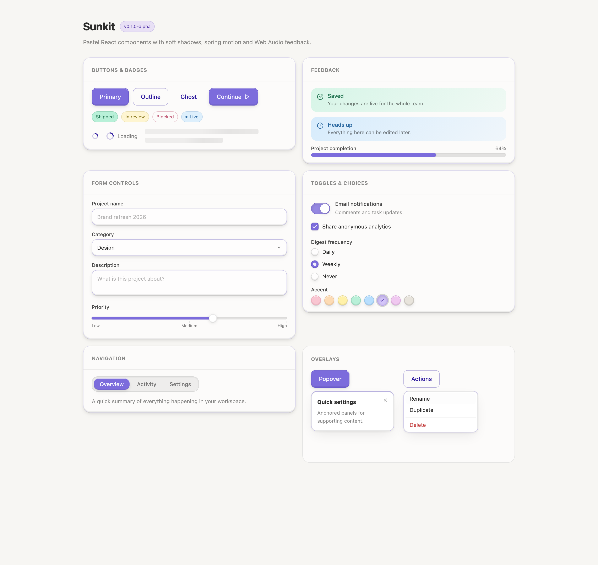

<details>
<summary>Dark theme</summary>

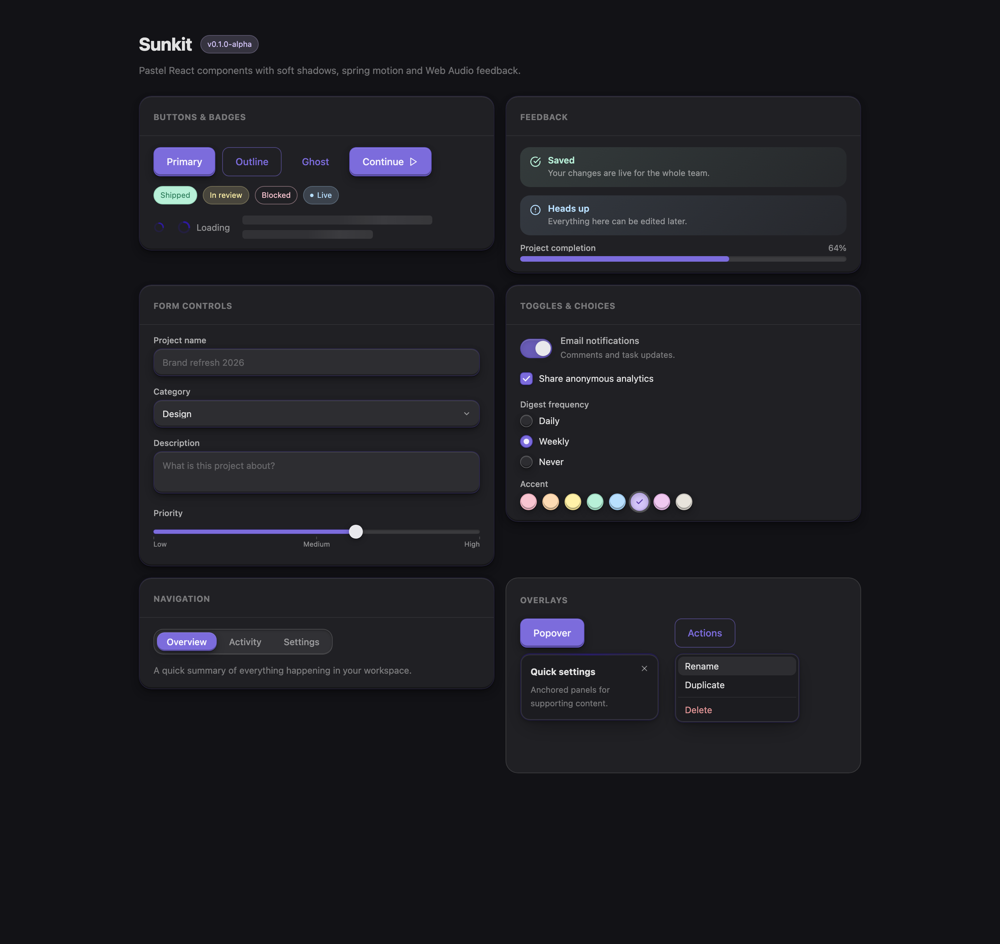

</details>

A full application built from Sunkit components:

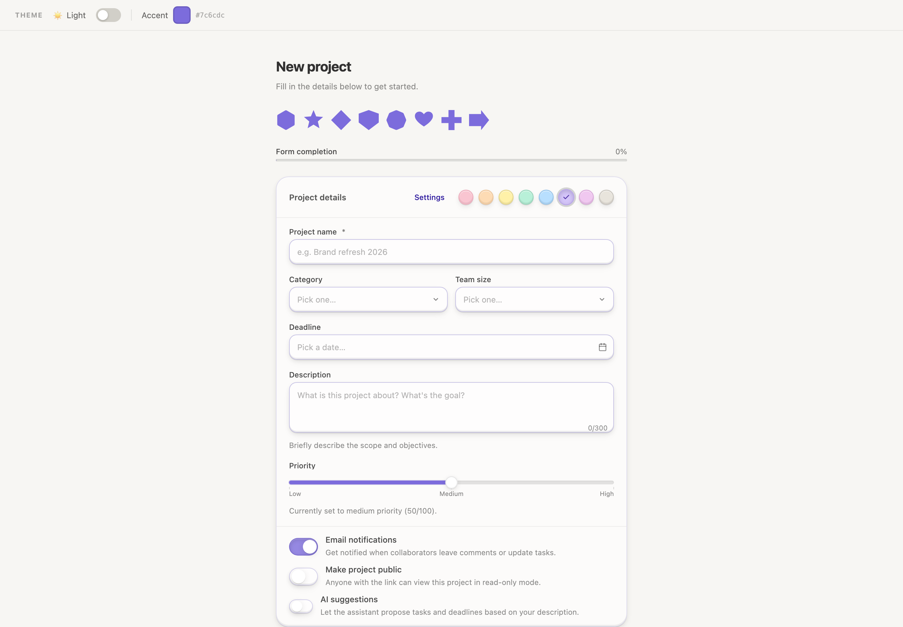

<details>
<summary>More component screenshots</summary>

| | |
| --- | --- |
| 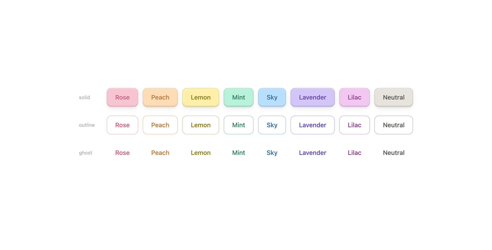 | 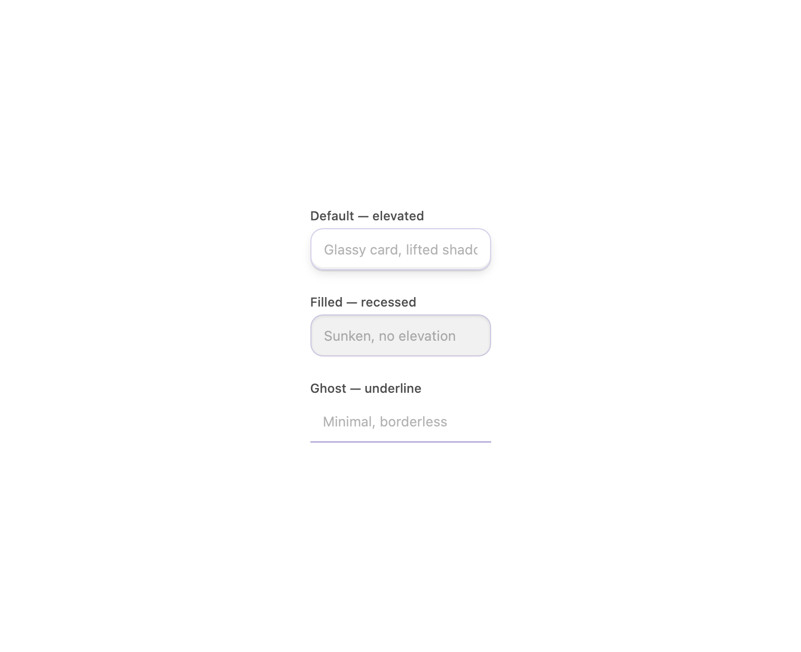 |
| 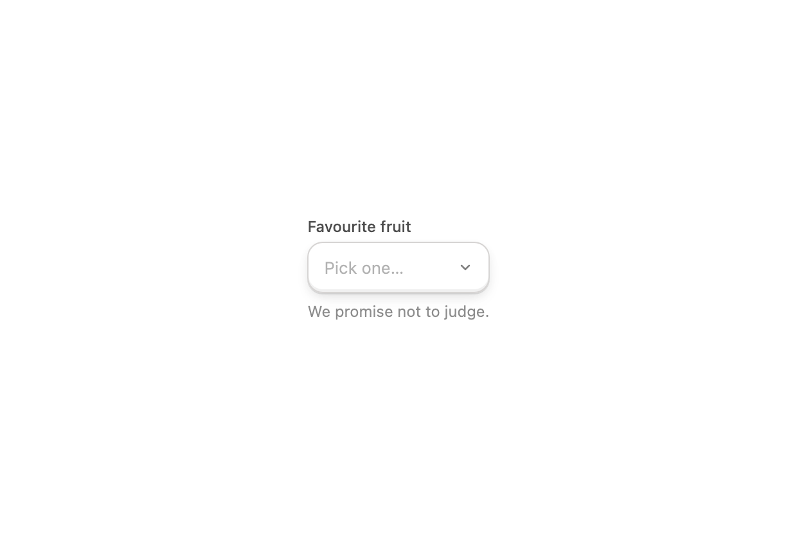 | 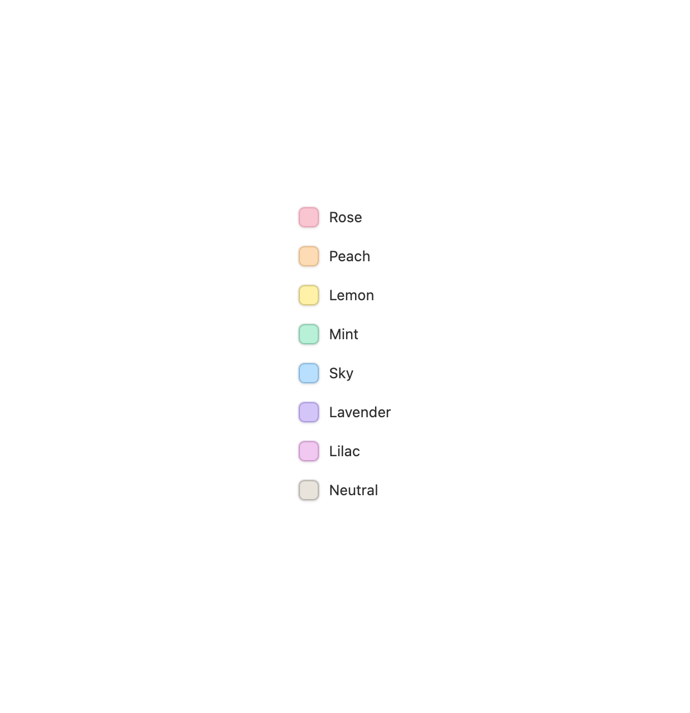 |
| 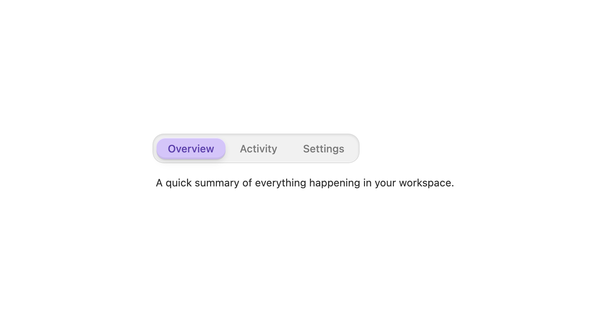 | 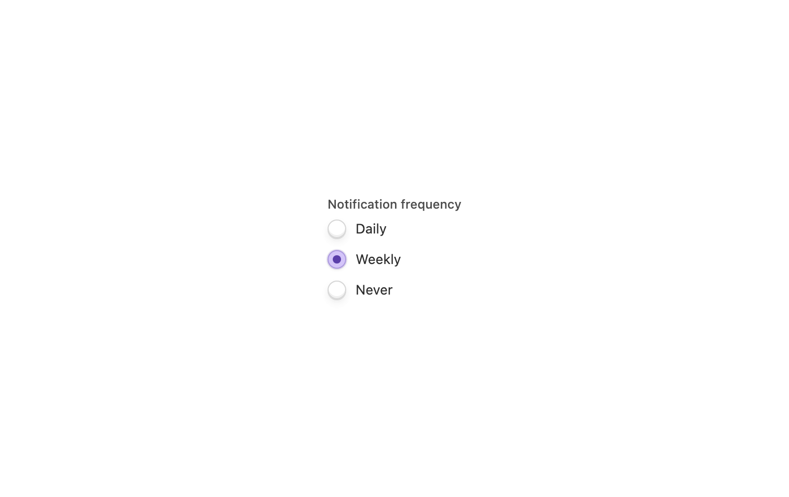 |
| 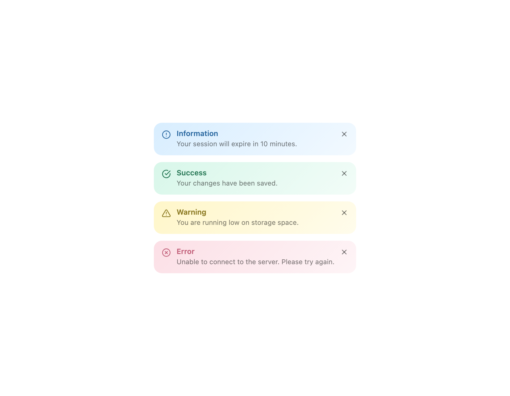 | 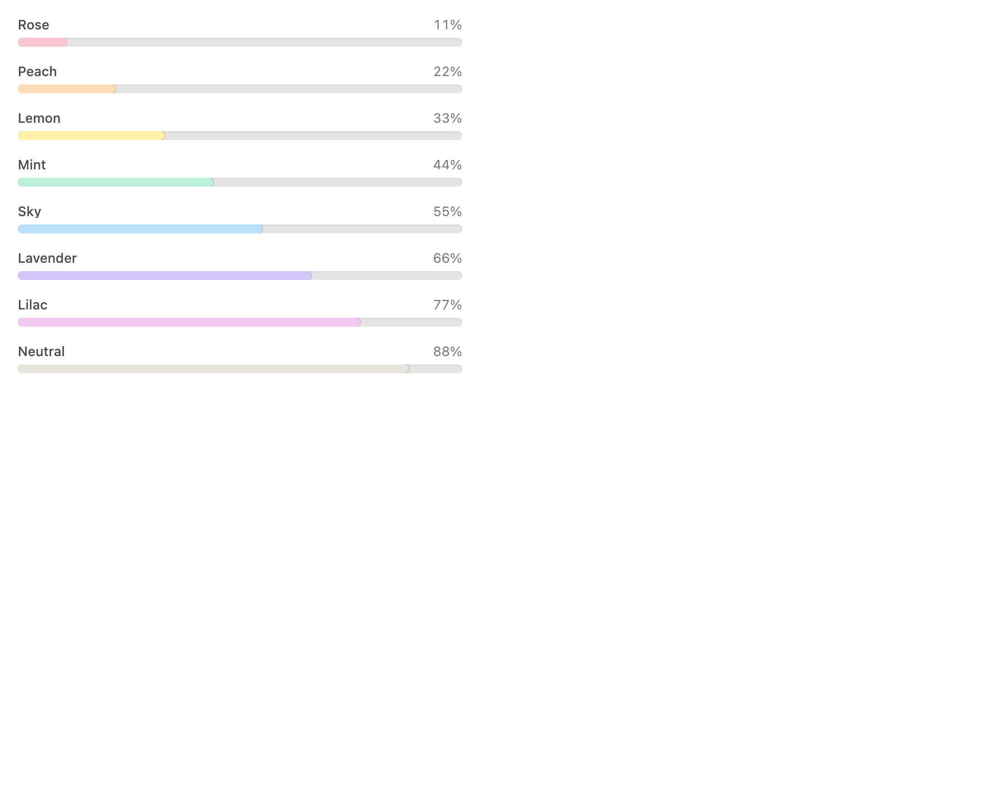 |
| 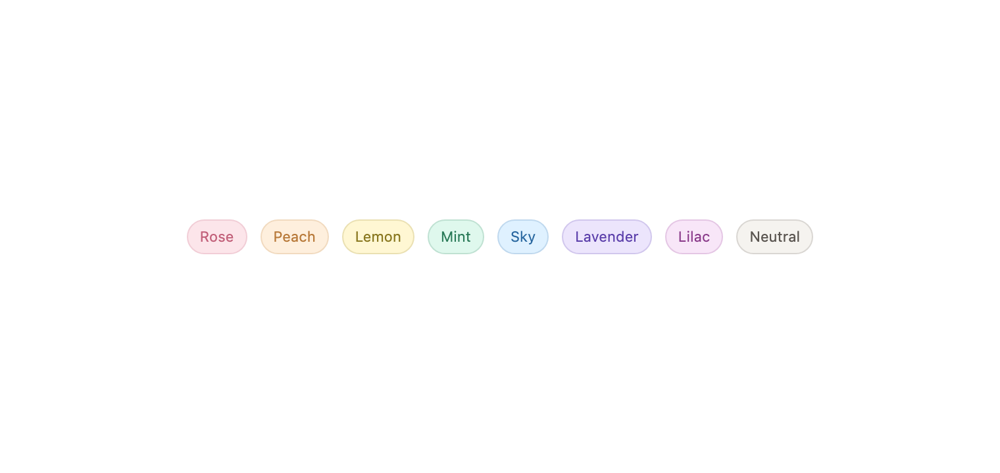 | 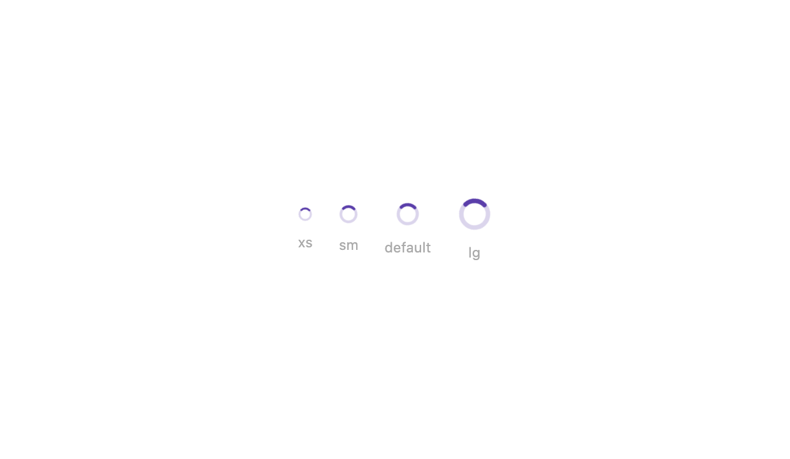 |

</details>

## Installation

```bash
pnpm add sunkit-ui@alpha
```

Peer dependencies (install if not already present):

```bash
pnpm add react react-dom
```

## Setup

Sunkit ships a CSS file that must be imported once — it registers the Tailwind theme (pastel colour tokens) and the utility classes (`btn-shadow`, keyframe animations, etc.).

### With Tailwind CSS v4 (recommended)

Add the sunkit CSS layer to your global stylesheet:

```css
/* app/globals.css */
@import "tailwindcss";
@import "sunkit-ui/sunkit.css";
```

### Without Tailwind (standalone)

```tsx
// main.tsx or _app.tsx
import 'sunkit-ui/sunkit.css'
```

## Usage

```tsx
import { Button, Card, Input, ThemeProvider } from 'sunkit-ui'

export function App() {
  return (
    <ThemeProvider accentColor="#7c6cdc">
      <Card variant="elevated" tone="lavender">
        <Card.Body>
          <Input label="Project name" placeholder="Brand refresh 2026" tone="lavender" />
          <Button color="lavender">Create project</Button>
        </Card.Body>
      </Card>
    </ThemeProvider>
  )
}
```

Every component accepts a `tone` (one of the eight pastel tokens) and an optional
`accentColor` that derives a matching fill/border pair at runtime.

## Sound design

Every interactive component has its own sonic identity. Instead of hand-rolled
oscillators, Sunkit now uses **[cuelume](https://cuelume.dev)** — a curated
palette of 17 interaction sounds synthesized live with the Web Audio API, with a
single shared `AudioContext` and zero audio files. cuelume is bundled into the
build, so it stays a zero-dependency install for consumers.

Sunkit maps component intents (`press`, `toggle`, `menuOpen`, `commit`, …) onto
the cuelume palette in one place, so the whole library can be re-tuned centrally.

Sound is enabled by default and always best-effort: playback is suppressed when
`prefers-reduced-motion: reduce` is set and never throws when an `AudioContext`
is unavailable (SSR, autoplay policies, tests).

### Global controls

Wrap your app in `SoundProvider` to wire up an app-level preference:

```tsx
import { SoundProvider } from 'sunkit-ui'

export function Root() {
  return (
    <SoundProvider volume={0.7} respectReducedMotion>
      <App />
    </SoundProvider>
  )
}
```

`useSound()` gives you the current settings and setters — perfect for a mute toggle:

```tsx
import { useSound } from 'sunkit-ui'

function SoundToggle() {
  const { enabled, setEnabled } = useSound()
  return (
    <button onClick={() => setEnabled(!enabled)}>
      {enabled ? 'Mute' : 'Unmute'}
    </button>
  )
}
```

Imperative helpers are exported too: `playCue('success')`, `playSound('chime')`,
`setSoundEnabled(false)`, `setSoundVolume(0.4)`.

## Components

| Component | Notes |
| --- | --- |
| `Button` | 8 tones, solid/outline/ghost, sizes, icons, press/release sound |
| `Input` / `Textarea` | 3 variants, adornments, labels, errors, counts |
| `Select` | Searchable, keyboard-driven combobox with `aria-activedescendant` |
| `Checkbox` / `Toggle` | Accessible controls with animated marks/knobs |
| `RadioGroup` | Composable radios with roving focus |
| `Slider` | Marks, tones, sizes, scrubbing sound |
| `DatePicker` | Single date and date range with a custom calendar |
| `ColorPicker` | Pastel tokens — each colour gets its own voice |
| `Progress` | Determinate and indeterminate |
| `Card` | Composable `Card.Header` / `Body` / `Footer` |
| `Alert` | info / success / warning / error, dismissable |
| `Dialog` | Focus trap, scroll lock, portal, spring animation |
| `Tabs` | Horizontal/vertical, roving tabindex |
| `Tooltip` | Hover/focus, four sides |
| `Popover` | Anchored panel with outside-click + Escape |
| `DropdownMenu` | Composable menu with keyboard navigation |
| `Badge` | Soft/solid/outline pills, optional dot |
| `Skeleton` | Text/circular/rectangular shimmer |
| `Spinner` | Sized, toned, reduced-motion aware |
| `Shape` | Geometric accents (hexagon, star, heart, …) |
| `ThemeProvider` | Global accent colour + light/dark |

## Development

```bash
pnpm install
pnpm storybook        # local Storybook at http://localhost:6006
pnpm test             # vitest
pnpm test:watch
pnpm typecheck
pnpm lint
pnpm format
pnpm build            # library build → dist/
pnpm build-storybook  # static Storybook → storybook-static/
```

### Screenshots

The screenshots in `docs/` are generated from the local Storybook using a
headless Chrome. With Storybook running on port 6006:

```bash
CHROME="/Applications/Google Chrome.app/Contents/MacOS/Google Chrome" pnpm screenshots
```

### Releasing

Versions and changelogs are managed with
[Changesets](https://github.com/changesets/changesets). Add a changeset for
your change and commit it alongside the code:

```bash
pnpm changeset          # choose patch / minor / major and describe the change
```

On every push to `main`, the **Release** workflow opens (or updates) a
"Version Packages" PR. Merging that PR publishes to npm (with provenance) and
creates a git tag and GitHub Release. While the project is in prerelease mode,
versions go out under the `alpha` dist-tag:

```bash
pnpm add sunkit-ui@alpha
```

## License

[MIT](./LICENSE)
